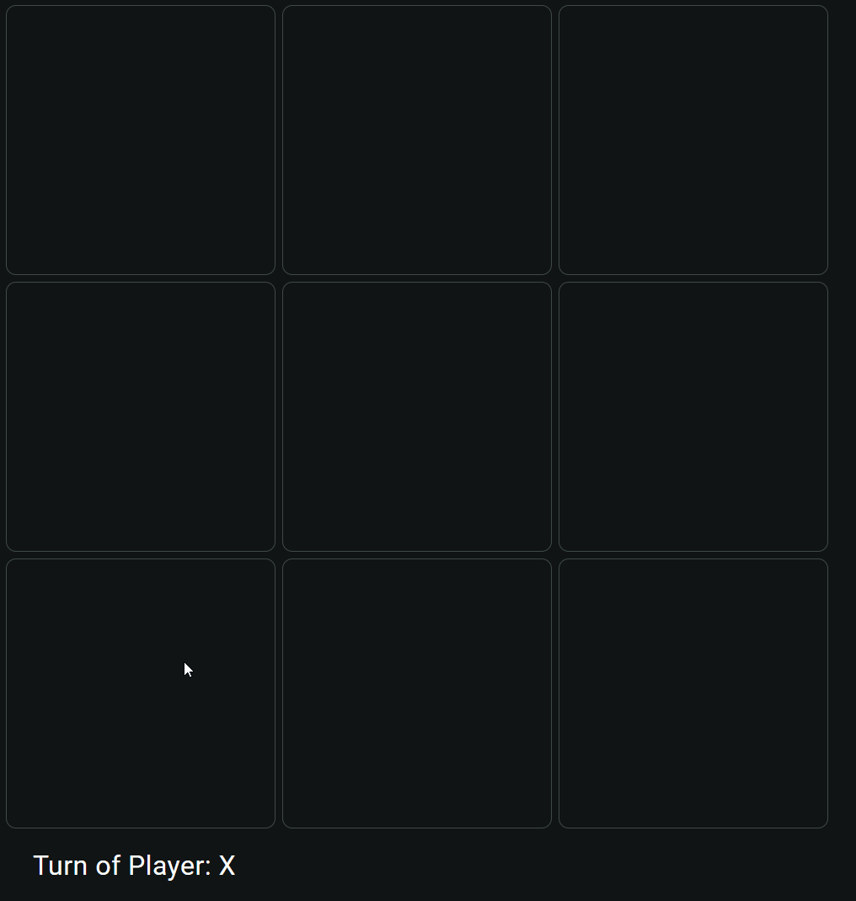

= Assignment: TicTacToe

With all those things you learnt so far, you can already implement a simple game of TicTacToe.
Use the following features:

* Parent & child component
* Input & output signals
* Template bindings with signals
* Control structures
* CSS isolation
* Click events
* At least one Material component

The win-or-draw logic has to be correct, of course, you are real programmers now!
And I'd like to have a 'Restart' button.
In the end, it should look & work like this (but you are free to use whatever styling you want):

